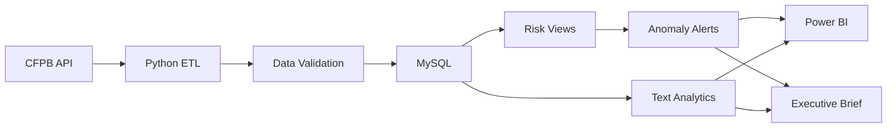
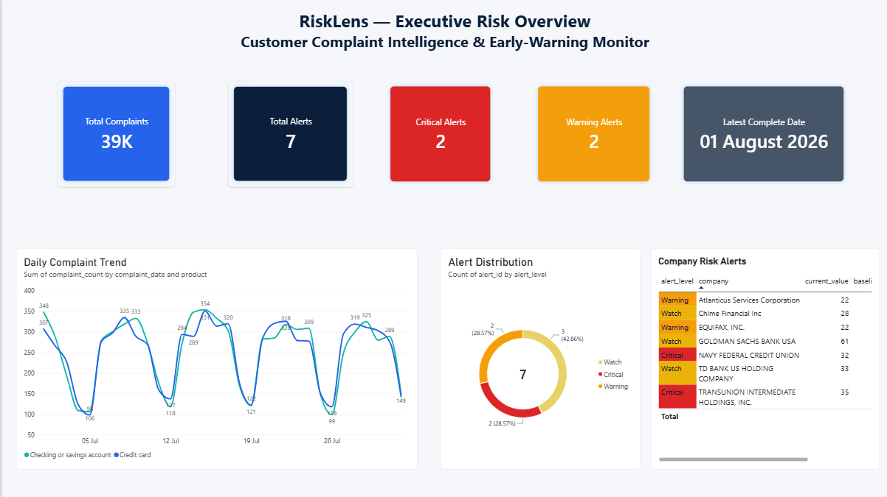
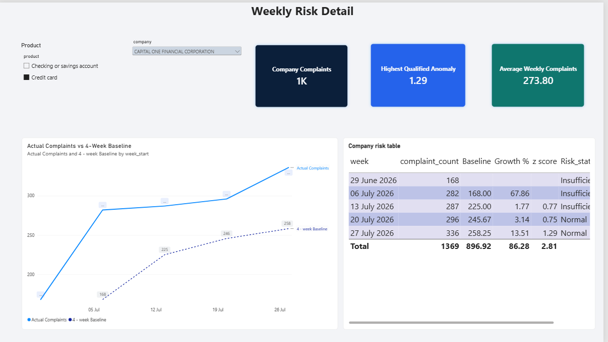
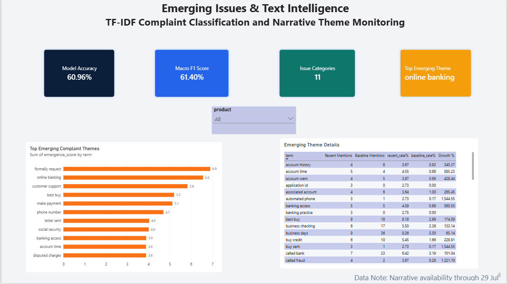
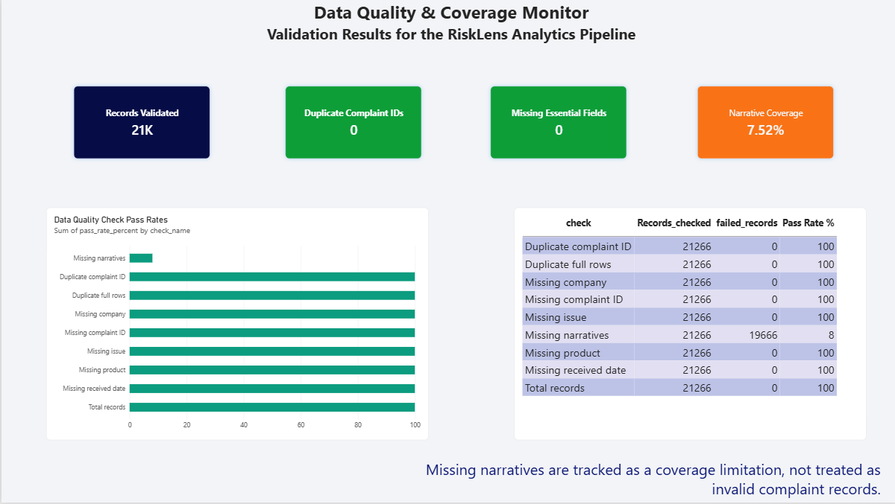

# RiskLens
[](https://github.com/thekivyx/RiskLens-customer-intelligence/actions/workflows/tests.yml)

## Customer Complaint Intelligence & Early-Warning Platform

RiskLens is a financial-services analytics platform that uses public CFPB complaint data to identify abnormal complaint spikes, company-level risk signals, emerging narrative themes, and data-quality limitations.

It combines API ingestion, Python ETL, MySQL analytics, anomaly detection, NLP classification, automated reporting, and Power BI.

## Architecture



## Key Features

- Extracts live complaint data from the CFPB REST API
- Processes historical data in smaller API chunks
- Cleans dates, fields, duplicates, and missing essential values
- Loads complaints into MySQL using complaint-ID upserts
- Calculates daily product and weekly company risk metrics
- Detects abnormal complaint spikes using rolling baselines and z-scores
- Classifies complaint issues using TF-IDF and Logistic Regression
- Detects emerging narrative phrases against a historical baseline
- Generates an automated Markdown executive brief
- Presents risks, alerts, NLP insights, and quality checks in Power BI

## Results

- 39,000+ complaints available in the analytical database
- 21,266 historical credit-card and checking-account complaints processed
- 7 company-level Watch, Warning, and Critical signals identified
- 1,457 narratives used for supervised text classification
- 11 complaint issue categories
- Model accuracy: 60.96%
- Macro F1-score: 61.40%
- Narrative coverage: 7.52%
- Zero duplicate complaint IDs in the validated dataset

## Anomaly Methodology

RiskLens compares current complaint volume with a rolling historical baseline:

```text
Z-score = (Current volume - Rolling average) / Rolling standard deviation
```

Risk levels:

- Critical: z-score ≥ 3
- Warning: z-score ≥ 2
- Watch: weekly growth ≥ 40%
- Normal: no significant deterioration

Low-volume records and incomplete CFPB publication periods are excluded from alert decisions.

## Text Classification

The complaint classifier uses:

- Consumer complaint narrative as input
- TF-IDF unigram and bigram features
- Logistic Regression with balanced class weights
- CFPB issue category as the target

Evaluation:

| Metric | Result |
|---|---:|
| Accuracy | 60.96% |
| Macro F1 | 61.40% |
| Weighted F1 | 60.83% |
| Categories | 11 |

## Generative AI-Assisted Theme Analysis

RiskLens extends its TF-IDF-based text analytics with a controlled Gemini workflow for emerging complaint clusters. Instead of sending the complete complaint dataset to an LLM, the pipeline selects the three highest-scoring themes per product and retrieves up to five supporting narratives for each theme.

Before API processing, common email addresses and number patterns are redacted. Gemini 3.5 Flash-Lite then returns schema-constrained JSON containing:

* An executive-ready cluster summary
* The primary unmet customer need
* Potential service or operational-risk implications
* An urgency classification
* A recommended investigation action
* Supporting complaint IDs
* A confidence value and human-review flag

Pydantic validates the response structure, and supporting complaint IDs are checked against the records actually supplied to the model. Outputs with ambiguous, sensitive or limited evidence are routed for human review.

### LLM Evaluation

Six emerging-theme summaries were reviewed using automated and manual checks:

| Evaluation measure                  | Result |
| ----------------------------------- | -----: |
| Valid supporting-evidence IDs       |    6/6 |
| Minimum evidence threshold met      |    6/6 |
| Valid confidence values             |    6/6 |
| Evidence-grounded summaries         |    6/6 |
| Coherent complaint clusters         |    4/6 |
| Actionable recommendations          |    4/6 |
| Unsupported claims detected         |    0/6 |
| Appropriate urgency classifications |    6/6 |

The evaluation showed that LLM output quality depends heavily on upstream cluster quality. Generic phrases such as “formally request” and “letter sent” combined unrelated complaint problems, so these outputs were retained for human review rather than treated as reliable automated findings.

This is a small portfolio evaluation and does not establish production-level model performance. The LLM-generated confidence value is not treated as a statistically calibrated probability.


## Power BI Dashboard

### Executive Risk Overview



### Company & Product Monitor



### Emerging Issues & Text Intelligence



### Data Quality & Coverage



## Project Structure

```text
RiskLens/
├── powerbi/
│   ├── RiskLens.pbix
│   └── screenshots/
├── reports/
│   ├── daily_briefs/
│   ├── emerging_themes.csv
│   ├── model_evaluation.csv
│   └── model_summary.txt
├── sql/
│   ├── 01_create_tables.sql
│   ├── 02_analysis_queries.sql
│   └── 03_risk_views.sql
├── src/
│   ├── extract_cfpb.py
│   ├── extract_history.py
│   ├── explore_data.py
│   ├── clean_data.py
│   ├── quality_report.py
│   ├── load_mysql.py
│   ├── text_analysis.py
│   ├── emerging_themes.py
│   └── executive_brief.py
├── .gitignore
├── README.md
└── requirements.txt
```

## Technology Stack

- Python
- pandas
- requests
- MySQL
- SQL window functions and analytical views
- scikit-learn
- TF-IDF
- Logistic Regression
- Power BI
- Git and GitHub

## Data Source

Consumer Financial Protection Bureau Consumer Complaint Database:

https://www.consumerfinance.gov/data-research/consumer-complaints/

## Testing and Reliability

RiskLens includes seven automated data-quality tests covering:

- Required schema validation
- Missing complaint IDs
- Duplicate complaint IDs
- Invalid received dates
- Missing required business fields
- Unexpected response-status values
- Empty dataset detection

Run the tests locally:

```bash
pytest -v

## Limitations

- Raw complaint volume does not account for company size or market share.
- Recently received complaints may be incomplete because of publication delay.
- Consumer narratives are available for only a subset of complaints.
- Risk scores are transparent analytical indicators, not official CFPB risk ratings.
- The text classifier is a portfolio baseline model, not a production decision system.